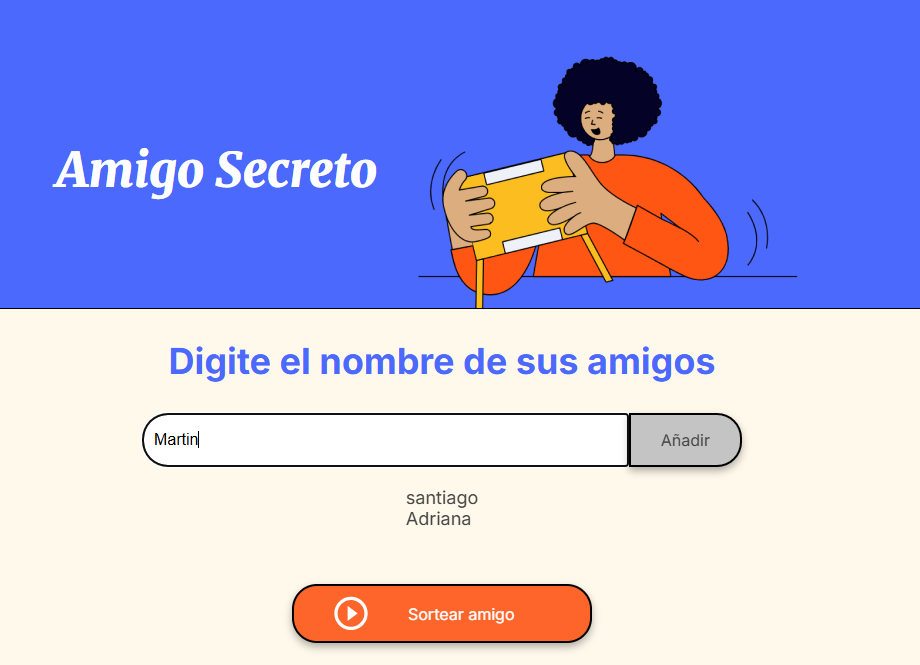
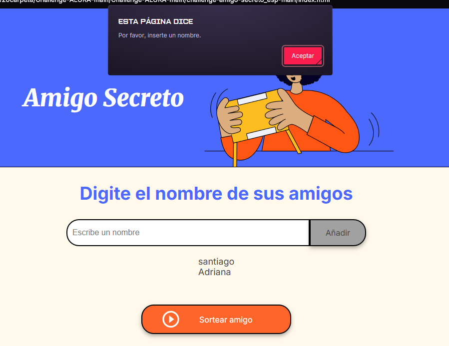
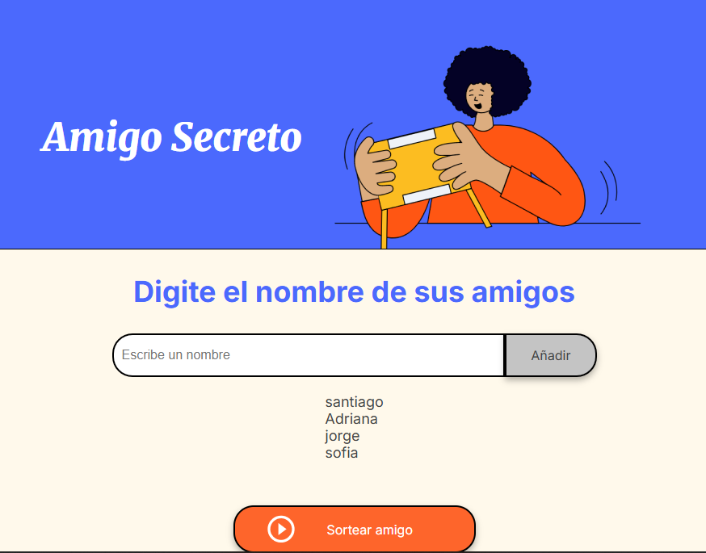
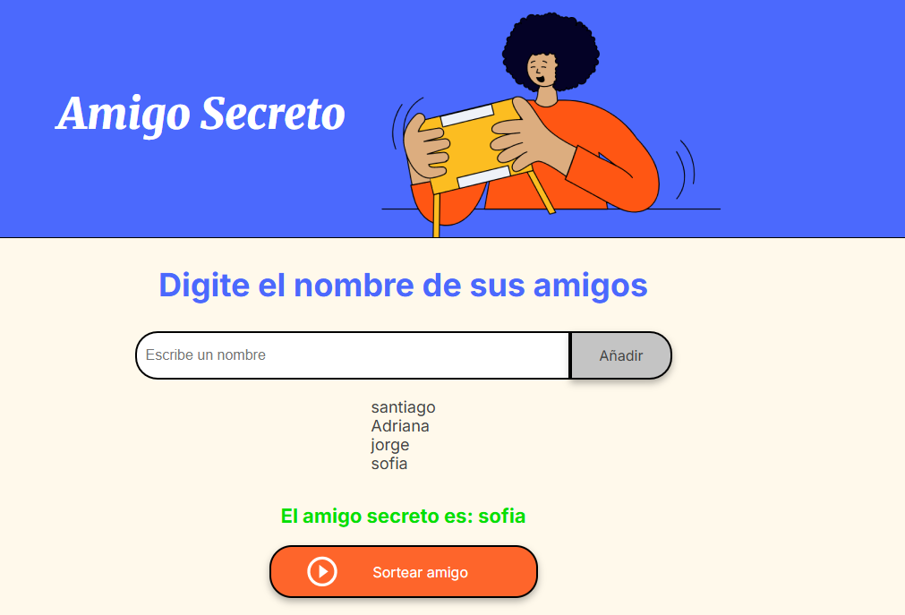

<h1 align="center"> Challenge Amigo secreto Alura </h1>  

Aplicación que permita a los usuarios ingresar nombres de amigos en una lista para luego realizar un sorteo aleatorio y determinar quién es el "amigo secreto".

## Funcionalidades

* Agregar nombres: Los usuarios escribirán el nombre de un amigo en un campo de texto y lo agregarán a una lista visible al hacer clic en "Adicionar".

* Validar entrada: Si el campo de texto está vacío, el programa mostrará una alerta pidiendo un nombre válido.

* Visualizar la lista: Los nombres ingresados aparecerán en una lista debajo del campo de entrada.

* Sorteo aleatorio: Al hacer clic en el botón "Sortear Amigo", se seleccionará aleatoriamente un nombre de la lista y se mostrará en la página.

## Cómo usar la aplicación

1.  Abre el archivo `index.html` en un navegador web.
2.  Ingresa los nombres de los amigos en el campo "Escribe un nombre" y haz clic en "Añadir".
3.  Una vez que hayas agregado todos los amigos, haz clic en el botón "Sortear amigo".
4.  El nombre del amigo secreto seleccionado aparecerá en la sección de resultados.

## Dependencias

Este proyecto no tiene dependencias externas.  Utiliza HTML, CSS y JavaScript puro.

## Desarrolador
Santiago Gabriel Ocaranza.